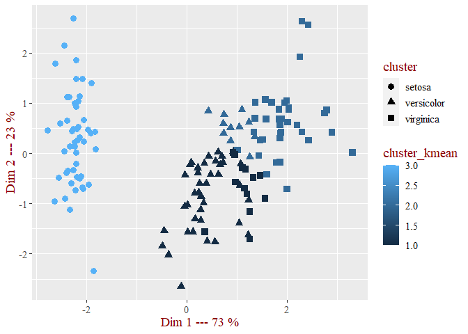
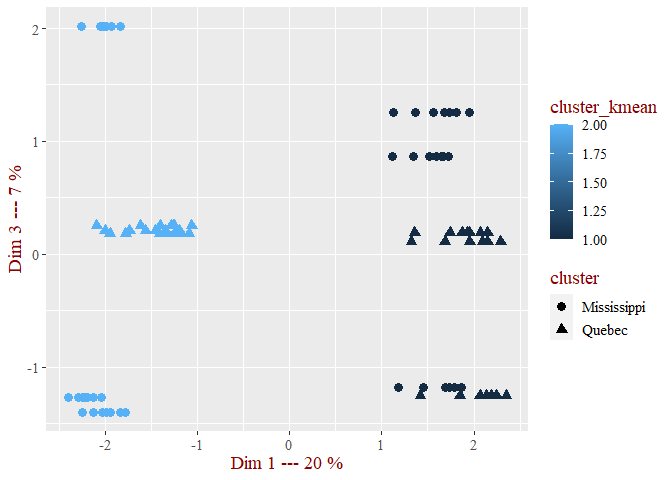
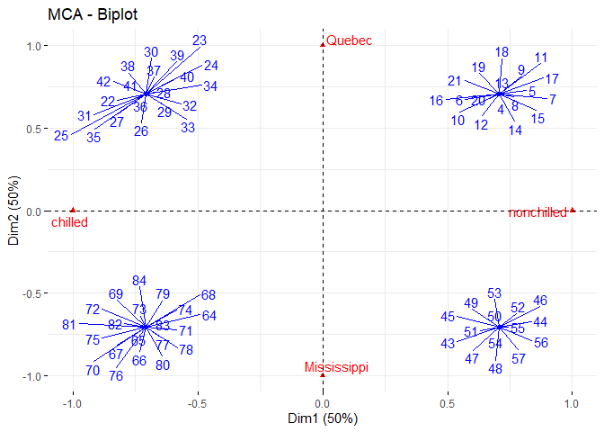

Introduction
============

This is a demonstration of using the R package ClustersAnalysis. You
will see how to analyze classes according to one or more variables. The
group variable must be of the type factor or character and the
exploratory variables can be quantitative or qualitative. In this
demonstration we are going to use natives dataset from R such as “iris”,
“infert” or “esoph”.

Short Descriptions of datasets
------------------------------

### Iris :

The data set consists of 50 samples from each of three species of Iris
(Iris setosa, Iris virginica and Iris versicolor). Four features were
measured from each sample: the length and the width of the sepals and
petals, in centimeters. Based on the combination of these four features,
Fisher developed a linear discriminant model to distinguish the species
from each other.

    summary(iris)

    ##   Sepal.Length    Sepal.Width     Petal.Length    Petal.Width   
    ##  Min.   :4.300   Min.   :2.000   Min.   :1.000   Min.   :0.100  
    ##  1st Qu.:5.100   1st Qu.:2.800   1st Qu.:1.600   1st Qu.:0.300  
    ##  Median :5.800   Median :3.000   Median :4.350   Median :1.300  
    ##  Mean   :5.843   Mean   :3.057   Mean   :3.758   Mean   :1.199  
    ##  3rd Qu.:6.400   3rd Qu.:3.300   3rd Qu.:5.100   3rd Qu.:1.800  
    ##  Max.   :7.900   Max.   :4.400   Max.   :6.900   Max.   :2.500  
    ##        Species  
    ##  setosa    :50  
    ##  versicolor:50  
    ##  virginica :50  
    ##                 
    ##                 
    ## 

### Infert :

This is a matched case-control study dating from before the availability
of conditional logistic regression.

    summary(infert)

    ##    education        age            parity         induced      
    ##  0-5yrs : 12   Min.   :21.00   Min.   :1.000   Min.   :0.0000  
    ##  6-11yrs:120   1st Qu.:28.00   1st Qu.:1.000   1st Qu.:0.0000  
    ##  12+ yrs:116   Median :31.00   Median :2.000   Median :0.0000  
    ##                Mean   :31.50   Mean   :2.093   Mean   :0.5726  
    ##                3rd Qu.:35.25   3rd Qu.:3.000   3rd Qu.:1.0000  
    ##                Max.   :44.00   Max.   :6.000   Max.   :2.0000  
    ##       case         spontaneous        stratum      pooled.stratum 
    ##  Min.   :0.0000   Min.   :0.0000   Min.   : 1.00   Min.   : 1.00  
    ##  1st Qu.:0.0000   1st Qu.:0.0000   1st Qu.:21.00   1st Qu.:19.00  
    ##  Median :0.0000   Median :0.0000   Median :42.00   Median :36.00  
    ##  Mean   :0.3347   Mean   :0.5766   Mean   :41.87   Mean   :33.58  
    ##  3rd Qu.:1.0000   3rd Qu.:1.0000   3rd Qu.:62.25   3rd Qu.:48.25  
    ##  Max.   :1.0000   Max.   :2.0000   Max.   :83.00   Max.   :63.00

### Esoph :

Data from a case-control study of (o)esophageal cancer in
Ille-et-Vilaine, France. This is a data frame with records for 88
age/alcohol/tobacco combinations.

    summary(esoph)

    ##    agegp          alcgp         tobgp        ncases         ncontrols    
    ##  25-34:15   0-39g/day:23   0-9g/day:24   Min.   : 0.000   Min.   : 1.00  
    ##  35-44:15   40-79    :23   10-19   :24   1st Qu.: 0.000   1st Qu.: 3.00  
    ##  45-54:16   80-119   :21   20-29   :20   Median : 1.000   Median : 6.00  
    ##  55-64:16   120+     :21   30+     :20   Mean   : 2.273   Mean   :11.08  
    ##  65-74:15                                3rd Qu.: 4.000   3rd Qu.:14.00  
    ##  75+  :11                                Max.   :17.000   Max.   :60.00

### CO2 :

The CO2 data frame has 84 rows and 5 columns of data from an experiment
on the cold tolerance of the grass species Echinochloa crus-galli.

    summary(CO2)

    ##      Plant             Type         Treatment       conc          uptake     
    ##  Qn1    : 7   Quebec     :42   nonchilled:42   Min.   :  95   Min.   : 7.70  
    ##  Qn2    : 7   Mississippi:42   chilled   :42   1st Qu.: 175   1st Qu.:17.90  
    ##  Qn3    : 7                                    Median : 350   Median :28.30  
    ##  Qc1    : 7                                    Mean   : 435   Mean   :27.21  
    ##  Qc3    : 7                                    3rd Qu.: 675   3rd Qu.:37.12  
    ##  Qc2    : 7                                    Max.   :1000   Max.   :45.50  
    ##  (Other):42

Import ClustersAnalysis from Github (using devtools)
====================================================

    #Use the below line to install devtools if necessary
    #install.packages("devtools")
    #library(devtools)

    #install package from github
    #Use the below line to install ClustersAnalysis if necessary
    #devtools::install_github("clepadellec/ClustersAnalysis")

    #load package
    library(ClustersAnalysis)

How to access to help
---------------------

You can juste use the fonction help(function name) to see all the
documentation about your function.

    help("u_plot_size_effect")

Univariate Analysis for qualitatives variariables
=================================================

To begin we will try to understand, for each qualitative explanatory
variable, if it affects the group variable. It’s necessary to create an
object of univariate type. You can use the constructor
**Univariate\_object**.

    #Creation of univariate object using esoph dataframe and "agegp" (first column) as the group variable
    u_esoph<-Univariate_object(esoph,1)

    #detail of attributes associated with the object
    print(u_esoph)

    ## $ind.qual
    ##     agegp     alcgp     tobgp    ncases ncontrols 
    ##      TRUE      TRUE      TRUE     FALSE     FALSE 
    ## 
    ## $ind.quan
    ##     agegp     alcgp     tobgp    ncases ncontrols 
    ##     FALSE     FALSE     FALSE      TRUE      TRUE 
    ## 
    ## $df
    ##    agegp     alcgp    tobgp ncases ncontrols
    ## 1  25-34 0-39g/day 0-9g/day      0        40
    ## 2  25-34 0-39g/day    10-19      0        10
    ## 3  25-34 0-39g/day    20-29      0         6
    ## 4  25-34 0-39g/day      30+      0         5
    ## 5  25-34     40-79 0-9g/day      0        27
    ## 6  25-34     40-79    10-19      0         7
    ## 7  25-34     40-79    20-29      0         4
    ## 8  25-34     40-79      30+      0         7
    ## 9  25-34    80-119 0-9g/day      0         2
    ## 10 25-34    80-119    10-19      0         1
    ## 11 25-34    80-119      30+      0         2
    ## 12 25-34      120+ 0-9g/day      0         1
    ## 13 25-34      120+    10-19      1         1
    ## 14 25-34      120+    20-29      0         1
    ## 15 25-34      120+      30+      0         2
    ## 16 35-44 0-39g/day 0-9g/day      0        60
    ## 17 35-44 0-39g/day    10-19      1        14
    ## 18 35-44 0-39g/day    20-29      0         7
    ## 19 35-44 0-39g/day      30+      0         8
    ## 20 35-44     40-79 0-9g/day      0        35
    ## 21 35-44     40-79    10-19      3        23
    ## 22 35-44     40-79    20-29      1        14
    ## 23 35-44     40-79      30+      0         8
    ## 24 35-44    80-119 0-9g/day      0        11
    ## 25 35-44    80-119    10-19      0         6
    ## 26 35-44    80-119    20-29      0         2
    ## 27 35-44    80-119      30+      0         1
    ## 28 35-44      120+ 0-9g/day      2         3
    ## 29 35-44      120+    10-19      0         3
    ## 30 35-44      120+    20-29      2         4
    ## 31 45-54 0-39g/day 0-9g/day      1        46
    ## 32 45-54 0-39g/day    10-19      0        18
    ## 33 45-54 0-39g/day    20-29      0        10
    ## 34 45-54 0-39g/day      30+      0         4
    ## 35 45-54     40-79 0-9g/day      6        38
    ## 36 45-54     40-79    10-19      4        21
    ## 37 45-54     40-79    20-29      5        15
    ## 38 45-54     40-79      30+      5         7
    ## 39 45-54    80-119 0-9g/day      3        16
    ## 40 45-54    80-119    10-19      6        14
    ## 41 45-54    80-119    20-29      1         5
    ## 42 45-54    80-119      30+      2         4
    ## 43 45-54      120+ 0-9g/day      4         4
    ## 44 45-54      120+    10-19      3         4
    ## 45 45-54      120+    20-29      2         3
    ## 46 45-54      120+      30+      4         4
    ## 47 55-64 0-39g/day 0-9g/day      2        49
    ## 48 55-64 0-39g/day    10-19      3        22
    ## 49 55-64 0-39g/day    20-29      3        12
    ## 50 55-64 0-39g/day      30+      4         6
    ## 51 55-64     40-79 0-9g/day      9        40
    ## 52 55-64     40-79    10-19      6        21
    ## 53 55-64     40-79    20-29      4        17
    ## 54 55-64     40-79      30+      3         6
    ## 55 55-64    80-119 0-9g/day      9        18
    ## 56 55-64    80-119    10-19      8        15
    ## 57 55-64    80-119    20-29      3         6
    ## 58 55-64    80-119      30+      4         4
    ## 59 55-64      120+ 0-9g/day      5        10
    ## 60 55-64      120+    10-19      6         7
    ## 61 55-64      120+    20-29      2         3
    ## 62 55-64      120+      30+      5         6
    ## 63 65-74 0-39g/day 0-9g/day      5        48
    ## 64 65-74 0-39g/day    10-19      4        14
    ## 65 65-74 0-39g/day    20-29      2         7
    ## 66 65-74 0-39g/day      30+      0         2
    ## 67 65-74     40-79 0-9g/day     17        34
    ## 68 65-74     40-79    10-19      3        10
    ## 69 65-74     40-79    20-29      5         9
    ## 70 65-74    80-119 0-9g/day      6        13
    ## 71 65-74    80-119    10-19      4        12
    ## 72 65-74    80-119    20-29      2         3
    ## 73 65-74    80-119      30+      1         1
    ## 74 65-74      120+ 0-9g/day      3         4
    ## 75 65-74      120+    10-19      1         2
    ## 76 65-74      120+    20-29      1         1
    ## 77 65-74      120+      30+      1         1
    ## 78   75+ 0-39g/day 0-9g/day      1        18
    ## 79   75+ 0-39g/day    10-19      2         6
    ## 80   75+ 0-39g/day      30+      1         3
    ## 81   75+     40-79 0-9g/day      2         5
    ## 82   75+     40-79    10-19      1         3
    ## 83   75+     40-79    20-29      0         3
    ## 84   75+     40-79      30+      1         1
    ## 85   75+    80-119 0-9g/day      1         1
    ## 86   75+    80-119    10-19      1         1
    ## 87   75+      120+ 0-9g/day      2         2
    ## 88   75+      120+    10-19      1         1
    ## 
    ## $group
    ## [1] 1
    ## 
    ## $name_group
    ## [1] "agegp"
    ## 
    ## $lst_quali
    ## [1] "agegp" "alcgp" "tobgp"
    ## 
    ## $lst_quanti
    ## [1] "ncases"    "ncontrols"
    ## 
    ## $multiple_var
    ## [1] TRUE

Contingency table and size effect
---------------------------------

The first thing we can do is to create a contingency table between the
explanatory variable and the group variable and then visualize
lines/columns profils. In our case the explanatory variable is “tobgp”
which is the tobacco consumption (gm/day). To do this you can use the
**u\_desc\_profils**

    #use interact=TRUE to show an interactive graphique with widgets like zoom, comparisons...
    ClustersAnalysis::u_desc_profils(u_esoph,3,interact=TRUE)

    ## [1] "Tableau de contingence : "
    ##        
    ##         0-9g/day 10-19 20-29 30+
    ##   25-34        4     4     3   4
    ##   35-44        4     4     4   3
    ##   45-54        4     4     4   4
    ##   55-64        4     4     4   4
    ##   65-74        4     4     4   3
    ##   75+          4     4     1   2
    ## [1] "Profils lignes : "
    ##           
    ##            0-9g/day 10-19 20-29 30+   Total
    ##   25-34     26.7     26.7  20.0  26.7 100.0
    ##   35-44     26.7     26.7  26.7  20.0 100.0
    ##   45-54     25.0     25.0  25.0  25.0 100.0
    ##   55-64     25.0     25.0  25.0  25.0 100.0
    ##   65-74     26.7     26.7  26.7  20.0 100.0
    ##   75+       36.4     36.4   9.1  18.2 100.0
    ##   Ensemble  27.3     27.3  22.7  22.7 100.0
    ## [1] "Profils colonnes : "
    ##        
    ##         0-9g/day 10-19  20-29  30+    Ensemble
    ##   25-34  16.67    16.67  15.00  20.00  17.05  
    ##   35-44  16.67    16.67  20.00  15.00  17.05  
    ##   45-54  16.67    16.67  20.00  20.00  18.18  
    ##   55-64  16.67    16.67  20.00  20.00  18.18  
    ##   65-74  16.67    16.67  20.00  15.00  17.05  
    ##   75+    16.67    16.67   5.00  10.00  12.50  
    ##   Total 100.00   100.00 100.00 100.00 100.00

<!--html_preserve-->

<!--/html_preserve-->

The distributions don’t show any particular phenomena. The most
represented classes are the 35-44 and 55-64 years. Then we can see that
there are more than a half that smokes less than 20 g/days. The only
fact that we can see is that the 75+ people are close to 75% to don’t
smoke a lot.

Now we are going to see in details if there is a size effect between
these two variables. To do this we can use **u\_desc\_size\_effect**
which return the test statistic vt (comparison between proportions).
Then we can also use **u\_plot\_size\_effect** which create a mosaic
plot.

    u_desc_size_effect(u_esoph,3)

    ##        
    ##         0-9g/day 10-19 20-29 30+ Sum
    ##   25-34        4     4     3   4  15
    ##   35-44        4     4     4   3  15
    ##   45-54        4     4     4   4  16
    ##   55-64        4     4     4   4  16
    ##   65-74        4     4     4   3  15
    ##   75+          4     4     1   2  11
    ##   Sum         24    24    20  20  88

    ##        
    ##           0-9g/day      10-19      20-29        30+
    ##   25-34 -0.1291915 -0.1291915 -0.6565969  0.9484178
    ##   35-44 -0.1291915 -0.1291915  0.9484178 -0.6565969
    ##   45-54 -0.5038193 -0.5038193  0.5690195  0.5690195
    ##   55-64 -0.5038193 -0.5038193  0.5690195  0.5690195
    ##   65-74 -0.1291915 -0.1291915  0.9484178 -0.6565969
    ##   75+    1.6158165  1.6158165 -2.7373833 -0.9124611

    #use intecract=TRUE to show an interactive graphique with widgets like zoom, comparisons...
    u_plot_size_effect(u_esoph,3,interact=FALSE)

    ## Warning: Ignoring unknown aesthetics: width

 If we
refer to the results we can see that the biggest “vt” values are for 75+
peoples who smokes 0-9g/day or 10-19 g/day. So this is for these two
combinations that one can most easily conclude that there is an
over-representation. We can use the mosaic plot to confirm our comment.

You can do the sames analyses for the variable “tobgp”.

Chisq test
----------

We can now use **u\_chisq\_test\_all** which is use to calculate the
p-avlue for a chisq test between the group variable and each
qualitatives variables.

    u_chisq_test_all(u_esoph)

    ##   var.groupement var.explicative p.value.chisq.test   interpretation
    ## 1          agegp           alcgp  0.999997088517426 non significatif
    ## 2          agegp           tobgp  0.999902175028874 non significatif
    ##   intensité(v cramer)
    ## 1                <NA>
    ## 2                <NA>

Here we can see that the p-avlues are very high which mean that we
accept the null hypothesis and the variables are independant. Because of
this, it’s useless to calculate v-cramer.

If you want to see significant results you can run the code below, the
aim is to predict the sexe according to many qualitatives attributs. We
can see that for each chisq.test, we can conclude that the sex depends
on the attributs. But the attributs which has the most influence is
“qualif”.

    #install.packages("questionr")
    #library(questionr)
    # data(hdv2003)
    # d<- hdv2003[,3:8]
    # u_chisq_test_all(Univariate_object(d,1))

Correspondence analysis
-----------------------

To better visualize if some groups are close to a particular modality we
can use correspondence analysis. The **u\_afc\_plot** function return a
biplot to visualize our results.

    u_afc_plot((Univariate_object(esoph,1)),3)

In our case the principal information that we can see is that the 25-34
peoples are quite close to 30+g/day. It’s a new information that we
didn’t have before.

Univariate Analysis for quantitatives variables
===============================================

Now we are going to use the famous iris dataset. The aim si to
understand how the Species can be described.

    #Creation of univariate object with the "Species" as group variable
    u_iris <-Univariate_object(iris,5)

Means comparisons (using student test)
--------------------------------------

To begin we are going to search for each group and each explanatory
variable if the fact to belong to a species or not have an influence on
the length and the width of Petal/Sepal. To do this we use
**u\_ttest\_all**, this function for each group, separates the group
variable into two modalities : target modality or others modality. Then
we verify normality hypothesis and if it’s possible we use a student
test to define if it’s significative or not.

     u_ttest_all(u_iris)

    ##            Sepal.Length       Sepal.Width        Petal.Length  
    ## setosa     "significatif"     "significatif"     "significatif"
    ## versicolor "non significatif" "significatif"     "significatif"
    ## virginica  "significatif"     "non significatif" "significatif"
    ##            Petal.Width       
    ## setosa     "significatif"    
    ## versicolor "non significatif"
    ## virginica  "significatif"

Here we can see that each group have one or many significatives
variables which mean that the fact to belong to setosa,versicolor or
virginica have an influence on the attributs.

Fisher Test
-----------

    u_fisher_test_all(u_iris)

    ##                   Eta2 Test_value p_value
    ## Sepal.Length 0.6187057  119.26450       0
    ## Sepal.Width  0.4007828   49.16004       0
    ## Petal.Length 0.9413717 1180.16118       0
    ## Petal.Width  0.9288829  960.00715       0

Multivariate Analysis
=====================

In this section, we characterize the group variable by using several
qualitative or quantitative explanatory variables. If the data contains
categorical variables, we encode it to numbers by using one-hot
encoding. This is an intermediate step of the functions in our package,
therefore our functions can take as input a qualitative data,
quantitative data or mixed data.

To begin we compute the proportion between inter-class inertia and total
inertia. It’s necessary to create an object of multivariate type as
Univariate Analysis part. You can use the constructor
**Multivariate\_object**.

    #Creation of multivariate object in case of quantitative data using iris dataframe and
    # "Species" (fifth column) as the group variable
    m_iris<-multivariate_object(iris,5)

    #Creation of multivariate object in case of mixed data using iris dataframe and 
    # "Type" (second column) as the group variable
    m_CO2<-multivariate_object(data.frame(CO2),2)

    #detail of attributes associated with the object
    #print(m_iris)
    #print(m_CO2)

Proportion between inter-class inertia and total inertia (R square)
-------------------------------------------------------------------

Starting with the quantitative case in Iris data, we have a high R
square (0.87) which results a clear categorization of three types of the
Iris flower by four explanatory variables.

    #quantitative data
    m_R2_multivariate(m_iris)

    ## [1] 0.8689444

Turning to mixed data, we encode qualitative explanatory variables to
numbers by using one-hot encoding. Also, we rescale quantitative
explanatory ones (rescale = TRUE). R square is not high in this case.

    #mixed data
    m_R2_multivariate(m_CO2, rescale = TRUE)

    ## [1] 0.125534

Internal measures
-----------------

Two internal measures are investigated in this section in order to
evaluate the goodness of a clustering structure without respect to
external information including Silhouette index and Davies Boulin index.

### Silhouette index

Silhouette coefficient of Iris data is high for all three species
(setorsa, versicolor and virginica), which unifies results of R square
in the previous part. In other words, these four explanatory variables
clearly categorize three types of flowers mentioned above. Moreover,
silhouette coefficient of setosa is extremely higher than that of two
types rest. This results provide that setosa is separated to the rest,
which can be observed by graphic “ACP and Silhouette” representing
individuals in the factorial plan in which different shapes represent
variables groups, at the meanwhile, distinguish colors represent
silhouette coefficients.

    m_silhouette_ind(m_iris)

    ##   [1]  0.846469167  0.807398624  0.822366948  0.796876817  0.842846154
    ##   [6]  0.736507297  0.814515322  0.847356179  0.742514780  0.817476712
    ##  [11]  0.794022278  0.828702784  0.802439759  0.737078463  0.689960878
    ##  [16]  0.628999725  0.766148464  0.844448086  0.692395962  0.812505487
    ##  [21]  0.773274497  0.818253227  0.785451525  0.784113653  0.764467842
    ##  [26]  0.789153491  0.825818819  0.834753090  0.836562949  0.809910370
    ##  [31]  0.806887667  0.789361476  0.752791405  0.710627128  0.821092541
    ##  [36]  0.825165104  0.784801580  0.835250278  0.759758982  0.843495197
    ##  [41]  0.843051188  0.625304380  0.778506146  0.791253901  0.734990902
    ##  [46]  0.801610336  0.805121738  0.811665590  0.809962469  0.845574752
    ##  [51]  0.063715563  0.340711283 -0.064281513  0.561473318  0.305000462
    ##  [56]  0.530022415  0.200545585  0.308661268  0.319555176  0.543435800
    ##  [61]  0.406053695  0.550061016  0.537256657  0.385789403  0.571311879
    ##  [66]  0.321608094  0.472621711  0.605407613  0.372686019  0.603296093
    ##  [71]  0.147370132  0.583675548  0.154964703  0.424476170  0.485144208
    ##  [76]  0.371265559  0.103724987 -0.181429615  0.475130100  0.556363272
    ##  [81]  0.583818539  0.574789098  0.617045132  0.012110302  0.452127963
    ##  [86]  0.342655400  0.148502744  0.439260455  0.584909351  0.589378605
    ##  [91]  0.544467525  0.430746508  0.616053311  0.337310169  0.596447444
    ##  [96]  0.586870976  0.596975798  0.536457716  0.196223138  0.612465204
    ## [101]  0.486842095  0.044986135  0.532358573  0.420690626  0.536542484
    ## [106]  0.462715960 -0.374840516  0.479717476  0.437605428  0.484479316
    ## [111]  0.313233908  0.346347201  0.511927944 -0.040778258  0.186761261
    ## [116]  0.433115124  0.438175908  0.416637998  0.419567558 -0.180048546
    ## [121]  0.539110752 -0.110879955  0.436867338 -0.010490659  0.526019728
    ## [126]  0.491425863 -0.127795281 -0.052646866  0.487318513  0.439510070
    ## [131]  0.479010718  0.399922091  0.492761852  0.006878731  0.193836006
    ## [136]  0.466476643  0.462003014  0.420618071 -0.171385023  0.482116062
    ## [141]  0.531199096  0.388712742  0.044986135  0.548803450  0.520693164
    ## [146]  0.429514550  0.099807524  0.374300521  0.399617217  0.053972269

    m_silhouette_plot(m_iris, interact = FALSE)

    m_sil_pca_plot(m_iris, interact = FALSE)

 In
contrast, Silhouette coefficient of CO2 data is low for the origin of
the plant (Quebec and Mississippi) unifying results of R square above.

    m_silhouette_ind(m_CO2,rescale = TRUE)

    ##  [1] -0.159919623  0.066971709  0.146283669  0.184470793  0.154969542
    ##  [6]  0.184290085  0.130544554 -0.181591734  0.002721663  0.172098782
    ## [11]  0.225199097  0.217370250  0.204897674  0.163850659 -0.160316617
    ## [16]  0.096165825  0.206199936  0.229594240  0.235183107  0.222602347
    ## [21]  0.170555900 -0.178507102 -0.043239194  0.084318803  0.161092495
    ## [26]  0.124293406  0.150166578  0.129226510 -0.214066767  0.016210988
    ## [31]  0.158493623  0.211020134  0.209711652  0.177363430  0.158317525
    ## [36] -0.170452547 -0.102886050  0.192413471  0.150254799  0.211555843
    ## [41]  0.199002673  0.151591438  0.216267449  0.172864134  0.080751622
    ## [46]  0.010898985 -0.004475726 -0.034332808 -0.071670134  0.209264611
    ## [51]  0.136795082 -0.006122365 -0.026153013 -0.035538285 -0.007876043
    ## [56] -0.018762679  0.214833437  0.172732242  0.090197689  0.057550088
    ## [61]  0.048638632  0.051055364  0.032253641  0.231109208  0.225640474
    ## [66]  0.207878011  0.208524105  0.200849948  0.145043203  0.101659398
    ## [71]  0.241968570  0.249421768  0.258063487  0.263358912  0.263849005
    ## [76]  0.235467591  0.165995611  0.230160459  0.196237304  0.211542206
    ## [81]  0.221761240  0.221204490  0.190379759  0.122687023

    m_silhouette_plot(m_CO2,rescale = TRUE, interact = FALSE)

    m_sil_pca_plot(m_CO2, rescale=TRUE,interact = FALSE)

    m_sil_pca_plot(m_CO2, rescale=TRUE,interact = FALSE, i=1,j=3)

    m_sil_pca_plot(m_CO2, rescale=TRUE,interact = FALSE, i=2,j=3)

### Davies Bouldin index

A good Davies Bouldin index is indicated at a low value. Based on the
result analyzing, Davies Bouldin index of Iris data is low for all three
flower species, which is consistent with results mentioned above.
Specifically, Davies Bouldin index of setosa is seriously low, it,
therefore, distinguishes to versicolor and virginica.

    m_DB_index(m_iris)

    ##            Indice de Davies Bouldin
    ## setosa                    0.2853079
    ## versicolor                0.9151115
    ## virginica                 0.9151115

Davies Bouldin index of the origin of the plants (CO2 data) are high
(4.55), therefore, is consistent with results of R square and Silhouette
coefficient.

    m_DB_index(m_CO2, rescale = TRUE)

    ##             Indice de Davies Bouldin
    ## Mississippi                 4.546164
    ## Quebec                      4.546164

External measure
----------------

Two external measures in this section are investigated in order to
comparing two partitions including Rand index and Ajusted Rand index.

### Rand index

We establish an artificial partition from k-mean algorithm and we
compute the Rand index between variables group and artificial partition.
Rand index of Iris data is very high (0.83), hence, this partition and
variables group are similar. Further, Rand index of CO2 data is equal
0.49, thus, Ajusted Rand index is examined.

    m_kmean_rand_index(m_iris) 

    ## [1] 0.8322148

    m_kmean_rand_index(m_CO2, rescale=TRUE)

    ## [1] 0.4939759

### Ajusted Rand index

Based on the results of Ajusted Rand index of Iris data, we could
strongly confirm that artificial partition and variables group are
strongly similar. Furthermore, Ajusted Rand index of CO2 data is low,
resulting that there is no similar of two partitions.

    m_kmean_rand_ajusted(m_iris)

    ## [1] 0.6318665

    m_kmean_rand_ajusted(m_CO2, rescale = TRUE)

    ## [1] 0.1941748

### Comparison between kmean clustering and variable group

This graphic illustrates individuals on the factorial plan in which
different shapes represent variables groups, at the meanwhile,
distinguish colors represent artificial partitions.

    m_kmean_clustering_plot(m_iris, interact = FALSE)

    m_kmean_clustering_plot(m_iris, interact = FALSE, i=1,j=3)

    m_kmean_clustering_plot(m_iris, interact = FALSE,i=2,j=3)

    m_kmean_clustering_plot(m_CO2, rescale=TRUE, interact = FALSE)

    m_kmean_clustering_plot(m_CO2, rescale=TRUE, interact = FALSE, i=1,j=3)

    m_kmean_clustering_plot(m_CO2, rescale=TRUE, interact = FALSE, i=2,j=3)

Test value for clustering
-------------------------

Data analyzing allows us to several conclusions. First, Petal.Length
shows the most effective characterization on Setosa and virginica.
Second, Sepal.Width characterizes most powerful to versicolor.

    m_test.value(m_iris)

    ##                  setosa       pvalue
    ## Petal.Length -11.263787 1.980605e-29
    ## Petal.Width  -10.831410 2.443627e-27
    ## Sepal.Length  -8.757174 2.002060e-18
    ## Sepal.Width    7.364799 1.774136e-13

    m_test.value(m_iris,i=2)

    ##              versicolor       pvalue
    ## Sepal.Width  -5.7090437 1.136127e-08
    ## Petal.Length  2.4627269 1.378849e-02
    ## Petal.Width   1.4391384 1.501113e-01
    ## Sepal.Length  0.9691459 3.324724e-01

    m_test.value(m_iris,i=3)

    ##              virginica       pvalue
    ## Petal.Length  8.801060 0.000000e+00
    ## Petal.Width   9.392272 0.000000e+00
    ## Sepal.Length  7.788028 6.883383e-15
    ## Sepal.Width  -1.655755 9.777142e-02

Multiple component analysis
---------------------------

This function used to detect and represent underlying structures in a
qualitative data set.

    m_acm_plot(multivariate_object(CO2[,1:3],1))

